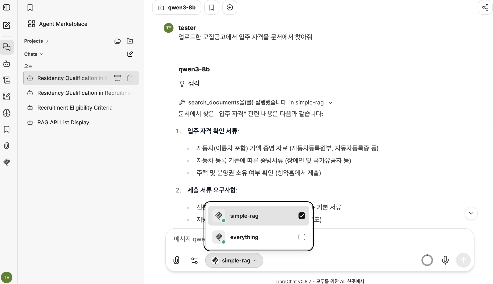
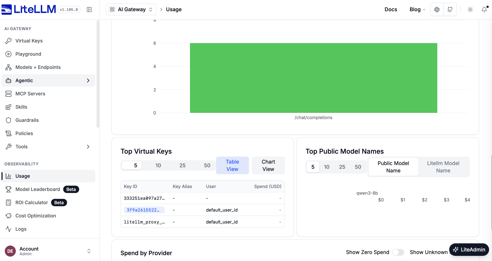

# vllm-mlx 기반 RAG 챗봇 구축 (1) - 전체 구성과 설치

RAG 챗봇을 만들려면 LLM 서빙부터 임베딩, 리랭킹, 벡터 저장소, 검색 API, 모델 게이트웨이, 챗봇 UI까지 여러 기술 요소가 필요하다. 이 시리즈는 이들을 로컬 환경에 직접 구동하고 연결하면서 각 기술의 역할과 연동 방식을 확인하고, 실제 RAG 챗봇 구축에 필요한 기술 조합을 PoC 형태로 검증한다. 1편에서는 전체 구성을 살펴보고, 설치부터 동작 확인까지 따라 하며 확인한다. 각 요소의 설계와 설정값의 근거는 2편부터 하나씩 다룬다.

**vllm-mlx 기반 RAG 챗봇 구축 시리즈**

- [(1) 전체 구성과 설치](01-overview.md) (현재 글)
- [(2) 모델 서버 구성과 메모리 설계](02-vllm-mlx.md)
- [(3) 문서 검색 API와 MCP 서버](03-simple-rag.md)
- [(4) LiteLLM 게이트웨이와 Fallback 전략](04-litellm.md)
- [(5) LibreChat UI와 MCP 도구 연동](05-librechat.md)
  
> 이 글의 설정은 M4 MacBook Pro(48GB 메모리, GPU 16코어)를 기준으로 한다. 모든 설정과 테스트는 이 환경을 기준으로 진행했다.

---

## 1. 프로젝트 소개

이 프로젝트는 RAG 챗봇 아키텍처 PoC를 위해 모델 서빙, 문서 저장 및 검색, 챗봇 연동, 장애 대응에 다음 기술 요소를 사용한다.

- Apple Silicon Mac에서 MLX로 **Qwen3-8B**(채팅), **bge-m3**(임베딩), **bge-reranker-v2-m3**(리랭크)를 직접 서빙한다.
- PDF, TXT, Markdown 문서를 올리면 청크로 나눠 임베딩한 뒤 Postgres(pgvector)에 저장한다.
- 챗봇(LibreChat)이 MCP 도구로 문서를 검색하고, 검색된 내용을 근거로 답한다.
- 로컬 모델에 장애가 나면 LiteLLM이 Gemini로 넘겨 대화가 끊기지 않게 한다.
  
---

## 2. 시스템 구성

### 2.1 아키텍처

```text
                         ┌─────────────────────── Docker ───────────────────────┐
 Browser ──► LibreChat ──┼─► LiteLLM (:4000) ──► vllm-mlx (host :8100) / Gemini │
   :3080         │       │                                                      │
                 |───────┼── simple-rag (:3000) ──► Postgres + pgvector         │
                 │  MCP  │          ▲                                           │
                 │       │          └─ embeddings ── vllm-mlx (host :8100)      │
                 └───────┼──  MongoDB (LibreChat users/chats)                   │
                         └──────────────────────────────────────────────────────┘
```

모든 대화는 LibreChat에서 시작해 LiteLLM을 거쳐 vllm-mlx의 채팅 모델로 전달된다. 문서가 필요하면 LibreChat이 MCP로 simple-rag를 호출하고, simple-rag는 vllm-mlx의 임베딩 모델로 질문을 벡터로 바꿔 pgvector에서 관련 청크를 찾는다. 문서를 올릴 때도 같은 임베딩 모델로 청크를 벡터로 바꿔 저장한다.

### 2.2 구성요소별 역할과 포트

| 구성요소 | 위치 | 포트 | 역할 | 다루는 편 |
|---|---|---|---|---|
| vllm-mlx | 호스트(macOS) | 8100 | 채팅·임베딩·리랭크 모델 서빙 | 2편 |
| simple-rag | Docker | 3000 | 문서 업로드·벡터 검색 API, MCP 서버 | 3편 |
| LiteLLM | Docker | 4000 | 모델 게이트웨이, 장애 시 Gemini fallback | 4편 |
| LibreChat | Docker | 3080 | 챗봇 웹 UI, 사용자 등록/로그인 | 5편 |
| Postgres(pgvector) | Docker | 127.0.0.1:5434 | 문서·청크·임베딩, LiteLLM DB | 3편 |
| MongoDB | Docker | 미공개 | LibreChat 사용자/대화 저장 | 5편 |
| mcp-everything | Docker | 3001 | MCP 테스트용 서버 | 5편 |

### 2.3 vllm-mlx를 호스트에서 실행하는 이유

구성요소 중 vllm-mlx만 컨테이너가 아니라 **호스트에서 직접** 실행한다. MLX는 macOS의 Metal을 쓰기 때문에 Docker 안에서는 GPU를 사용할 수 없다.

대신 컨테이너가 호스트에 접근해야 한다. 컨테이너들은 `host.docker.internal:8100`으로 vllm-mlx를 호출하고, 이 접근을 허용하려고 서버를 `localhost`가 아닌 `0.0.0.0`에 바인딩한다. 이 설정에는 보안상 주의할 점이 있는데, 이것도 2편에서 다룬다.

---

## 3. 사전 준비

- Apple Silicon Mac
- Git (저장소를 받기 위해 필요)
- [Docker Desktop](https://www.docker.com/products/docker-desktop/)
- [uv](https://docs.astral.sh/uv/): `brew install uv`
- 디스크 여유 공간: 약 25GB 이상 (모델 약 8GB + Docker 이미지 약 13GB)
- (선택) Gemini API 키: LiteLLM fallback용

---

## 4. 시작하기

### 4.1 소스 코드 다운로드

GitHub에서 저장소를 받은 뒤, 이후의 모든 명령은 이 디렉터리에서 실행한다.

```bash
git clone https://github.com/cnapcloud/mlx-rag-chatbot.git
cd mlx-rag-chatbot
```

### 4.2 모델 서비스 시작

호스트에서 vllm-mlx를 설치하고 모델을 받은 뒤 서버를 띄운다. 실행 설정은 Makefile 하나에 모아 두었다.

```bash
make install     # hf, vllm-mlx 설치 (uv tool)
make download    # 채팅/임베딩/리랭크 모델 다운로드 (최초 1회)
make run         # 서버 시작 (포그라운드, 터미널 하나를 점유)
```

`make run`은 터미널을 점유하므로 다른 터미널에서 확인한다.

```bash
curl http://localhost:8100/v1/models
```

기본 모델은 채팅용 `mlx-community/Qwen3-8B-4bit`, 임베딩용 `mlx-community/bge-m3-mlx-fp16`(1024차원)이다. 종료는 `make stop`이다.

> **임베딩은 vllm-mlx가 떠 있어야 한다.** 문서 업로드와 검색 모두 8100의 임베딩 API를 호출하므로, 서버가 꺼져 있으면 둘 다 실패한다.

### 4.3 환경 변수 설정

```bash
cp .env.example .env   # 이미 .env가 있으면 건너뛴다
```

| 변수 | 설명 |
|---|---|
| `LITELLM_MASTER_KEY` | LiteLLM 마스터 키. LibreChat이 이 값으로 LiteLLM에 접속하고, LiteLLM Admin UI 비밀번호로도 쓰인다. |
| `GEMINI_API_KEY` | Gemini fallback용. 비워 두면 `docker compose` 실행 시 경고가 나오고, Gemini 모델 호출만 실패한다. 무료 키 발급은 [참고](#1-gemini_api_key-무료-키-발급)를 확인한다. |

`compose.yaml`의 `CREDS_KEY`, `JWT_SECRET`, DB 비밀번호는 개발용 placeholder다. 외부에 노출하기 전에는 반드시 바꿔야 한다.

### 4.4 docker compose 실행

```bash
docker compose up -d --build
docker compose ps
```

첫 시작에는 이미지 pull과 `mcp-everything`의 `npm install` 때문에 몇 분이 걸린다. LibreChat은 `mcp-everything`가 healthy가 된 뒤에 시작하므로 한동안 올라오지 않아도 정상이다.

Postgres의 `rag`, `litellm` DB는 초기화 스크립트가 `data/postgres`가 비어 있을 때만 만든다. simple-rag 컨테이너는 시작할 때 테이블을 자동으로 생성한다.

상태는 다음 명령으로 확인한다.

```bash
curl http://localhost:3000/health              # {"status":"ok"}
curl http://localhost:4000/health/liveliness
docker compose logs -f librechat               # 에러 확인
```

---

## 5. 동작 테스트

### 5.1 문서 업로드

저장소에 샘플 문서가 들어 있다. `POST /documents`로 올리면 텍스트 추출, 청크 분할, 임베딩, pgvector 저장이 순서대로 이뤄진다.

```bash
curl -F "file=@simple-rag/samples/sample-policy.txt;type=text/plain" http://localhost:3000/documents
curl -F "file=@simple-rag/samples/cheongajin-notice.pdf;type=application/pdf" http://localhost:3000/documents
```

성공하면 `201`과 함께 문서 ID와 청크 수가 돌아온다.

```json
{ "data": { "documentId": "…uuid…", "chunksCreated": 12 } }
```

지원 형식은 PDF, TXT, Markdown이고 파일은 한 번에 하나, 최대 10MB다. `;type=`으로 mimetype을 명시해야 한다. 같은 파일을 두 번 올리면 중복 문서가 생기는데, 중복 방지는 아직 없다.

### 5.2 API 검색 확인

챗봇을 붙이기 전에 API로 먼저 검색이 되는지 확인한다. 문제가 생겼을 때 모델 문제인지 검색 문제인지 가르는 데에도 도움이 된다.

```bash
# 검색된 청크와 유사도만 반환
curl -X POST http://localhost:3000/search \
  -H 'content-type: application/json' \
  -d '{"question":"입주자 모집 자격이 뭐야?"}'

# 검색 + 답변 생성 (출처 포함)
curl -X POST http://localhost:3000/ask \
  -H 'content-type: application/json' \
  -d '{"question":"입주자 모집 자격이 뭐야?"}'
```

`/search`는 청크와 점수(유사도, 리랭크)만 돌려주므로 임베딩, 벡터 검색, 리랭크만 확인한다. `/ask`는 여기에 답변 생성과 출처까지 더한다. 검색 단계에서 유사도 0.35 미만인 청크는 제외되고, 남은 청크가 없으면 `/ask`는 모델을 부르지 않고 `I could not find this in the provided documents.`를 돌려준다. 이 기준은 3편에서 설명한다.

### 5.3 챗봇 사용자 등록과 MCP 도구 호출

LibreChat은 가입이 열려 있다.

1. <http://localhost:3080/register>에서 이름, 이메일, 비밀번호를 입력해 가입한다. 이메일 인증은 없다.
2. <http://localhost:3080/login>에서 로그인한다.

**처음 가입한 계정이 관리자**가 된다. 모델 목록에서 `qwen3-8b`(로컬)와 `gemini-3.5-flash-lite`를 고를 수 있고, 기본값은 `qwen3-8b`다.

문서 검색은 MCP 도구로 연결한다. 새 대화를 열고 입력창의 도구 메뉴에서 `simple-rag`를 활성화한 뒤 업로드한 문서에 대해 묻는다.

```text
업로드한 모집공고에서 입주 자격을 문서에서 찾아줘
```

<p align="center">
  
</p>


모델이 `search_documents`를 호출하고, 반환된 청크를 근거로 답하면 성공이다. 메뉴 위치는 LibreChat 버전에 따라 다르며, 도구 메뉴에 보이지 않으면 에이전트를 만들어 도구로 `simple-rag`를 추가한다. 도구 설정은 5편에서 자세히 다룬다.

LiteLLM 관리 UI는 <http://localhost:4000/ui>이고, 사용자명은 `admin`, 비밀번호는 `LITELLM_MASTER_KEY` 값이다.

<p align="center">
  
</p>

---

## 6. 중지와 초기화

```bash
docker compose down     # 컨테이너 중지/삭제 (데이터는 유지)
make stop               # vllm-mlx 종료
```

데이터까지 모두 지우려면 다음을 실행한다. **사용자, 대화, 업로드한 문서가 전부 사라진다.**

```bash
docker compose down
rm -rf data/mongodb data/postgres
```

`data/postgres`를 지우면 다음 시작 때 DB 초기화 스크립트가 다시 실행된다.

---

## 7. 마무리

vllm-mlx를 중심으로 simple-rag, LiteLLM, LibreChat을 연결해 로컬 RAG 챗봇 전체를 직접 실행하고, 문서 업로드와 검색, 챗봇의 MCP 도구 호출까지 동작을 확인했다.

RAG 챗봇은 모델 서빙, 문서 검색, 게이트웨이, 챗봇 UI가 맞물려 동작하는 하나의 시스템이다. 특히 임베딩과 리랭크는 vllm-mlx에서만 처리되고 채팅도 기본적으로 이 추론 서버를 거치므로, 이를 어떻게 구성하고 제한된 메모리 안에서 운영하느냐가 전체 동작을 좌우한다. 이에 다음 편에서는 vllm-mlx의 서빙 모델과 설정값, 메모리 배분을 살펴본다.

---

## 다음 편

[2편](02-vllm-mlx.md)에서는 모델 서버인 vllm-mlx를 다룬다. 설정값과, 제한된 메모리를 모델, KV cache, prefix cache에 배분하는 방식을 설명한다.

---

## 참고

### 1. GEMINI_API_KEY 무료 키 발급

1. [Google AI Studio](https://aistudio.google.com/apikey)에 Google 계정으로 로그인한다.
2. **Create API key** 버튼을 눌러 키를 만든다.
3. 생성된 키를 복사해 `.env`의 `GEMINI_API_KEY=` 뒤에 붙여 넣는다.

이 프로젝트가 쓰는 `gemini-3.5-flash-lite`와 `gemini-3.1-flash-lite`는 [가격 문서](https://ai.google.dev/gemini-api/docs/pricing)에서 무료 등급이 제공되는 것으로 확인했다. 한도는 바뀔 수 있으니 같은 문서를 확인한다. 키는 비밀번호처럼 다뤄야 하며, `.env`를 저장소에 커밋하지 않는다.

> **프라이버시 주의.** 가격 문서에 따르면 무료 등급에서는 입력한 콘텐츠가 Google의 제품 개선에 사용될 수 있다(유료 등급은 사용되지 않는다). fallback이 동작하면 RAG로 검색한 문서 내용이 Gemini로 전송되므로, 문서가 민감하다면 무료 키를 쓰지 않거나 `GEMINI_API_KEY`를 비워 fallback을 끄는 편이 맞다.


